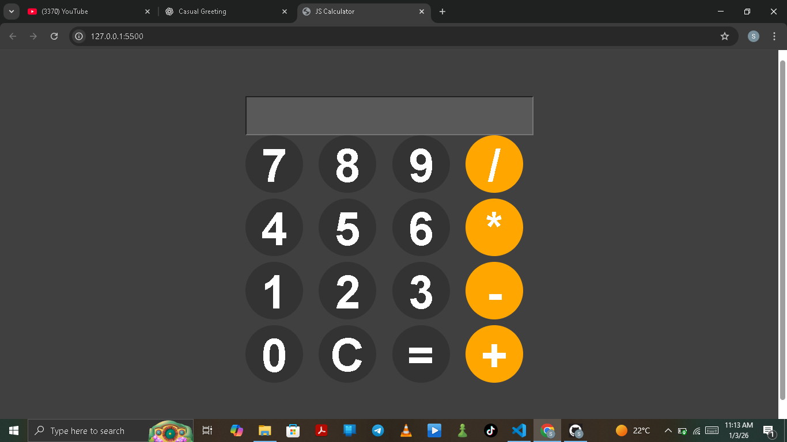

# 🧮 Modern JS Calculator

A sleek, responsive, and functional calculator web application built with a focus on clean UI and vanilla web technologies.



## 🚀 Features

* **Core Arithmetic**: Supports addition, subtraction, multiplication, and division.
* **Modern UI**: Minimalist dark-themed design using HSL color scales for depth and consistency.
* **Grid Layout**: Utilizes CSS Grid for a perfectly aligned 4-column button interface.
* **Error Handling**: Built-in logic to catch and display "Error" for invalid mathematical expressions.
* **Responsive Interaction**: Hover states on buttons provide tactile user feedback.

## 🛠️ Technologies Used

* **HTML5**: Semantic structure for the calculator body and display input.
* **CSS3**: Custom styling using Flexbox for centering and Grid for the keypad.
* **JavaScript (ES6)**: Functional logic for DOM manipulation and calculation processing.

## 📂 Project Structure

| File | Description |
| :--- | :--- |
| `index.html` | The structural layout and button definitions. |
| `style.css` | The visual design, including the dark theme and circular buttons. |
| `script.js` | The logic for appending values, clearing, and calculating results. |

## ⚙️ How It Works

1.  **Input**: The `appendToDisplay()` function captures button clicks and updates the display value.
2.  **Logic**: The `calculate()` function utilizes the JavaScript `eval()` method to process the string input.
3.  **Safety**: A `try...catch` block ensures the application remains stable even if an invalid equation is entered.

## 🔧 Installation & Usage

1.  Clone this repository:
    ```bash
    git clone [https://github.com/SamsaDon07/JS-Calculator.git](https://github.com/SamsaDon07/JS-Calculator.git)
    ```
2.  Navigate to the project folder.
3.  Open `index.html` in any modern web browser.

